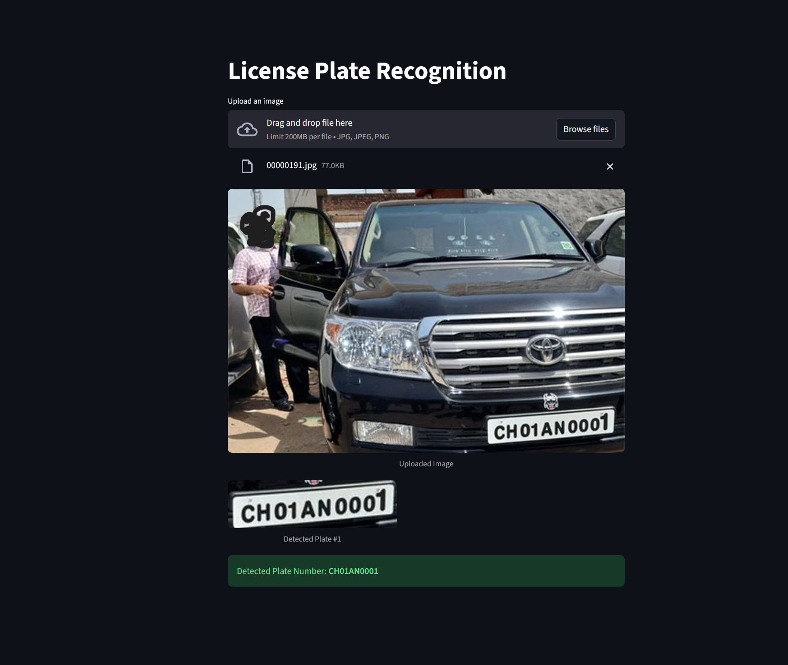

# 🚗 Automatic License Plate Recognition (ALPR) System

An end-to-end **Automatic License Plate Recognition (ALPR)** system that detects and reads vehicle number plates using deep learning.

This project combines:

* **YOLO (fine-tuned)** for license plate detection and cropping
* **TrOCR (fine-tuned)** for optical character recognition (OCR) on Indian number plates

---

## 📌 Features

* 🔍 Accurate number plate detection using YOLO
* ✂️ Automatic cropping of detected license plates
* 🔤 Text extraction using fine-tuned TrOCR
* 🇮🇳 Optimized for **Indian number plate formats**
* 🧪 Trained on augmented dataset for improved robustness

---

## 🧠 Model Architecture

### 1. Detection (YOLO)

* Fine-tuned YOLO model detects license plates in images
* Outputs bounding boxes for plate regions
* Crops detected plates for further processing

### 2. Recognition (TrOCR)

* Fine-tuned TrOCR model reads text from cropped plate images
* Trained on augmented Indian number plate dataset
* Handles variations in:

  * Fonts
  * Lighting conditions
  * Plate styles

---

## 🖼️ Demo



---

## 📂 Project Structure

```
.
├── src/
│   ├── app.png
├── weights.zip/
│   ├── best.pt     
│   └── last.pt          # Dataset (if included or sample)
├── notebooks/
    └──trocr_finetune_a100.ipynb


## 🚀 Usage

### Run Inference

```bash
streamlit run main.py
```

### Pipeline Steps

1. Input image is passed to YOLO model
2. License plate is detected and cropped
3. Cropped image is passed to TrOCR
4. Output text (plate number) is returned

---

## 🧪 Example Output

```
Input Image → Detected Plate → Recognized Text

MH12AB1234
```

---

## 📊 Training Details

### YOLO

* Fine-tuned on custom dataset of vehicle images
* Optimized for license plate localization

### TrOCR

* Fine-tuned on **augmented Indian number plate dataset**
* Augmentations include:

  * Blur
  * Noise
  * Rotation
  * Illumination changes

---

## ⚠️ Limitations

* Performance may degrade in:

  * Extreme low-light conditions
  * Heavily occluded plates
  * Non-standard or damaged plates

---

## 🔮 Future Improvements

* Real-time video stream support
* Multi-plate detection in crowded scenes
* Edge deployment optimization
* Integration with database systems

---

## 🤝 Contributing

Contributions are welcome. Feel free to open issues or submit pull requests.

---


## 🙌 Acknowledgements

* YOLO for object detection
* TrOCR for transformer-based OCR
* Open-source datasets and tools used in training

---
